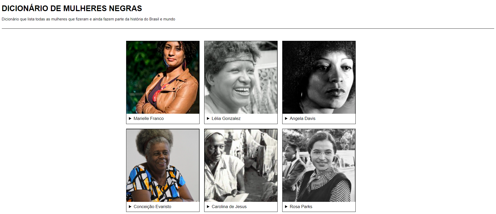

# Eu-ProgrAmo-Dicionario-de-mulheres-negras

## Projeto final do curso EuProgramo Front-End II da PrograMaria

Este projeto é um dicionário que lista as mulheres negras que fizeram e ainda fazem parte da história do Brasil e mundo

Feito com HTML, CSS e Javascript# Eu-ProgrAmo-Dicionario-de-mulheres-negras

# Eu Progr{amo} Front-End #2

> Turma 1

Dicionarios de Mulheres Negras que fizeram e ainda fazem parte da história do Brasil e do Mundo

[🔗 Clique aqui para acessar](https://soubeatrizkaroline.github.io/EuProgrAmo2_DicionarioMulheresNegras/)

## 🛠 Tecnologias

- HTML
- CSS
- JS
- Git e Github

## 💙 Contato

ebeatrizkcs@gmail.com